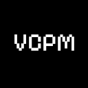

# VCPM - Voxel Core Project Manager

CLI util for managing voxel core content packs, with vcpm we can start 
new project and build it for release

## Instalation

```Bash
npm i -g vcpm
```

## Usage

### Help

```Bash
vcpm --help | -h
```

### Commands Help

```Bash
vcpm [command] --help | -h
```

### Build

```Bash
vcpm build
```

> Creates a zip archive for production use, removing in production build all files and folders which starts on dot, and remove type declarations folder.

### Development Build

```Bash
vcpm build -d | --dev
```

> Creates a zip archive for development use, without removing any files or folders

Archive format [pack_id]\_[version].zip

## Support OS

### Windows

- Windows 11 ✅ - 0.2.2

### Linux

- Arch Linux ✅ - 0.2.2

### MacOS

No tests on MacOS
